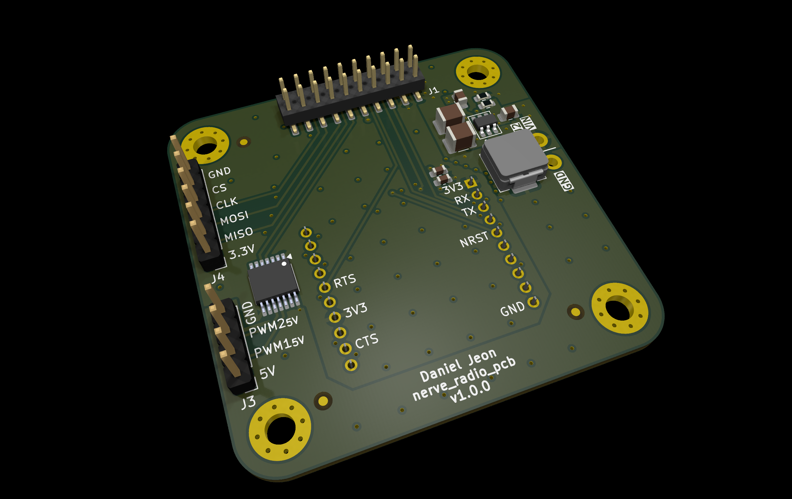
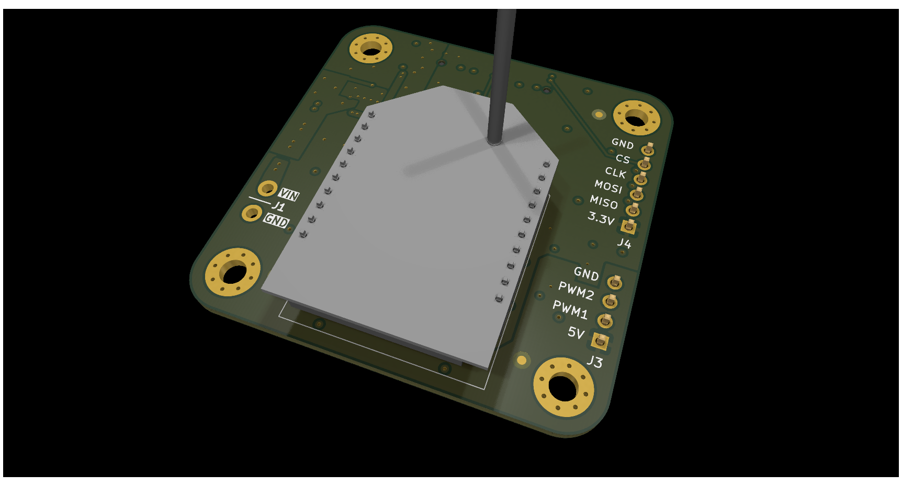

# nerve_radio_pcb

  
Table of Contents

<!-- TOC -->
* [nerve_radio_pcb](#nerve_radio_pcb)
  * [1 Overview](#1-overview)
  * [2 Board Specifications](#2-board-specifications)
    * [2.1 Connectors](#21-connectors)
  * [3 Release Notes](#3-release-notes)
    * [3.1 v0.1.0-alpha](#31-v010-alpha)
    * [3.2 v1.0.0 (WIP)](#32-v100-wip)
<!-- TOC -->

Production optimized radio module board for
the [nerve_pcb](https://github.com/danielljeon/nerve_pcb) project.

---

## 1 Overview

|                           Top                            |                             Bottom                             |
|:--------------------------------------------------------:|:--------------------------------------------------------------:|
|  |  |

---

## 2 Board Specifications

### 2.1 Connectors

Connectors fixed by hardware (PCB traces or the connector itself).

| Connector                       | Ref | Description                                                                  |
|---------------------------------|:---:|------------------------------------------------------------------------------|
| Bottom side 2x10 board-to-board | J1  | See schematic/layout for details                                             |
| LMR51430 buck (5 V) regulator   | J2  | Pin 1: Ground, Pin 2: VIN supply (> 5 V, <= 36 V)                            |
| 5 V GPIO/PWM breakout           | J3  | Pin 1: 5 V, Pin 2-3: GPIO/PWM 1-2 (5 V), Pin 5: Ground                       |
| SPI breakout                    | J4  | Pin 1: 3.3 V, Pin 2: MISO, Pin 3: MOSI, Pin 4: CLK, Pin 5: CS, Pin 6: Ground |

---

## 3 Release Notes

### 3.1 v0.1.0-alpha

- Pre-release 4-layer board variant.
    - Short-term pre-release board bring-up/testing release.
- Order date: 2025/01/13.

### 3.2 v1.0.0 (WIP)

- Incremented major version since `v0.1.0-alpha` pre-release due to partial
  redesign including full component changes.
    - Buck converter redesign (TPSM843x20 -> LMR51430), reasoning:
        - Potential supply chain risks and cost.
        - Improved compatibility in common buck converter IC footprints.
        - Reduced restrictions on space allocated for power supply circuits.
        - Improved input voltage range (> 5 V, <= 36 V) -> (> 5 V, <= 17 V).
        - Easier to test due to exposed switch node.
